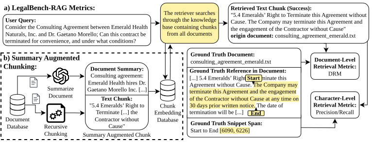

# Summary Augmented Chunking for Information Retrieval in the Legal Domain

**Summary Augmented Chunking(SAC)** is a framework designed to improve the reliability of Retrieval Augmented Generation (RAG) systems, particularly in the legal domain.

  
*Figure 1: Part a) illustrates how our retrieval quality metrics, Document-Level Retrieval Mismatch (DRM) and text-level precision/recall, are computed in the LegalBench-RAG (Pipitone and Alami, 2024) information retrieval task. Part b) shows the process of setting up the knowledge base using Summary Augmented Chunks (SAC).*

Standard RAG pipelines often suffer from a critical failure mode called **Document-Level Retrieval Mismatch (DRM)**, where the retrieval component selects context from entirely incorrect source documents. This project identifies DRM as a dominant failure mode in legal RAG and introduces **SAC**, a simple and computationally efficient technique to mitigate it.

The core contribution, **SAC**, generates a synthetic summary of the parent document and prepends it to each chunk before indexing. This technique enriches each text chunk with essential global context, making the retrieval process significantly more accurate.

## 📊 Key Results

Our research highlights three main findings:
1.  **DRM Reduction:** SAC drastically reduces Document-Level Retrieval Mismatch, preventing the model from being confused by boilerplate language across structurally similar legal documents.
2.  **Performance Boost:** By resolving DRM, SAC consequently improves overall text-level retrieval precision and recall across diverse legal benchmarks.
3.  **Generic vs. Expert Summaries:** Interestingly, generic summaries outperform expert-guided ones focusing on specific legal variables. Broad semantic cues appear more robust for guiding retrievers than dense, legally precise summaries.

## 🛠️ Installation

To use the framework, you need to install the required dependencies.

1. Create an anaconda environment (recommended):
   ```bash
   conda create -n sac_rag python=3.10
   conda activate sac_rag
   ```
2. Install the required packages:
   ```bash
   pip install -r requirements.txt
   ```
3. Run the `setup.py` script to setup the `sac_rag` package.
4. Setup the credentials for the AI models you want to use. Copy the `credentials/credentials.example.toml` file to `credentials/credentials.toml` and fill in your API keys.


## 📂 Codebase Overview

The project is organized into two main parts: a standalone retrieval library located in `src/sac_rag` and a set of evaluation benchmarks in the `benchmarks/` directory that use this library to produce the experimental results.

### Core Library: `src/sac_rag`

This directory contains the core, reusable RAG retrieval system. It is designed to be a standalone library that can be integrated into other projects.

*   `utils/retriever_factory.py`: This is the primary entry point for using the library. The `create_retriever` function takes a JSON configuration file and constructs the appropriate retrieval pipeline (currently either `Baseline` or `Hybrid`).
*   `utils/chunking.py`: This module is the heart of the SAC methodology. The `get_chunks` function implements the various chunking strategies. For `summary_naive` and `summary_rcts` strategies, it calls the summarization logic before prepending the summary to each chunk.
*   `methods/`: This package contains the different retrieval implementations.
    *   `baseline.py`: Implements a standard vector-search RAG pipeline.
    *   `hybrid.py`: Implements a hybrid retrieval approach combining sparse (BM25) and dense (vector) search.
*   `utils/ai.py`: This utility module manages all interactions with external or local AI models. It handles API calls or local production for embeddings, reranking, and, crucially, the `generate_document_summary` function which produces the summaries used in the SAC method. It also includes caching into a sqlite database (`data/cache/ai_cache.db/cache.db`) for all AI calls to improve performance.
*   `data_models.py`: Defines the core Pydantic data structures used throughout the library, such as `Document`, `Snippet`, `RetrievedSnippet`, and `QueryResponse`.
*   `utils/config_loader.py`: A helper to load and validate strategy configurations from JSON files into Pydantic models.

### Benchmarks: `benchmarks/`

This directory contains the scripts and code necessary to reproduce the results from our paper. Each subdirectory represents a distinct benchmark that uses the `sac_rag` library.

*   `legalbenchrag/`: This benchmark is focused on evaluating the **retrieval component** of the RAG system. It is build on the work of [Pipitone and Alami (2024)](https://github.com/zeroentropy-ai/legalbenchrag.git).
    *   `run_benchmark.py`: The main script to execute the retrieval tests and calculate metrics like precision, recall, and F1-score at the character overlap level.
    *   `plot/`: Contains scripts to analyze and visualize the results. `analyze_retrieval.py` calculates the Document-Level Retrieval Mismatch (DRM), while `plot_results.py` and `plot_retrieval_analysis.py` generate the performance graphs shown in the paper.
*   `alrag/`: Our custom-built benchmark for **end-to-end evaluation** of legal RAG systems. This is still in progress!
    *   `run_benchmark.py`: This script runs the full pipeline, from question to final answer generation, and evaluates the quality of the generated text against a ground truth answer as well as retrieval precision, recall, F1-Score and DRM.
*   `legalbench/`: Scripts to run experiments on tasks from the established LegalBench suite. It is build on the work of [Guha et al. (2023)](https://github.com/HazyResearch/legalbench.git).
    *   `run_benchmark.py`: The entry point for running the LegalBench tasks.

Each benchmark directory contains a `README.md` file with detailed instructions on how to run the benchmarks, including any required configurations and expected outputs.

## 📝 Citations

If you use this work, please cite:

```bibtex
@inproceedings{reuter2025towards,
  title={Towards Reliable Retrieval in RAG Systems for Large Legal Datasets},
  author={Reuter, Markus and Lingenberg, Tobias and Liepina, Ruta and Lagioia, Francesca and Lippi, Marco and Sartor, Giovanni and Passerini, Andrea and Sayin, Burcu},
  booktitle={Proceedings of the Natural Legal Language Processing Workshop 2025},
  pages={17--30},
  year={2025}
}
```
